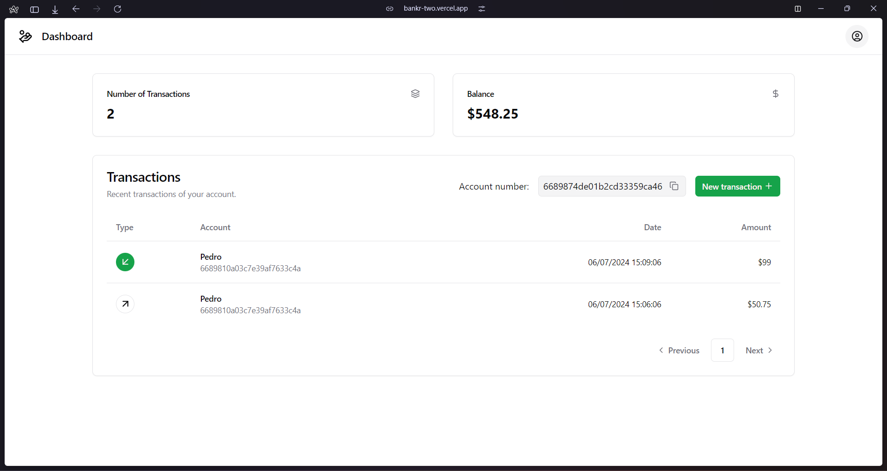
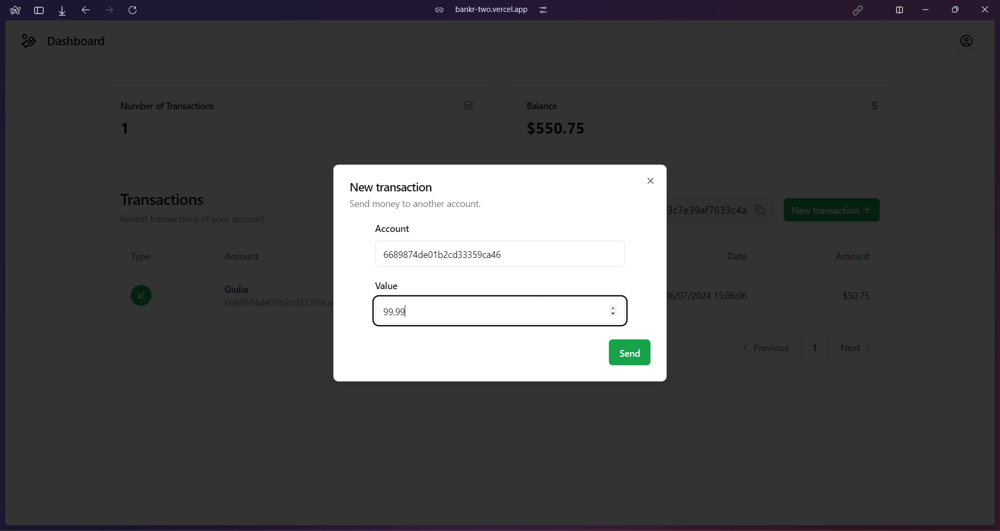

# Banking App

This is a simple banking, it allows an user to create an account and transfer money to other accounts.

## Demo

- [Live Demo](https://bankr-two.vercel.app/)
- [GraphQL Playground](https://bankr-prod.fly.dev/graphql)

Account page:

Creating a transaction:
 

## What's inside?

This Turborepo includes the following packages/apps:

### apps/server
The server is a simple [Koa](https://koajs.com/) + GraphQL server that uses [GraphQL Yoga](https://the-guild.dev/graphql/yoga-server) to handle the GraphQL requests. It uses [Mongoose](https://mongoosejs.com/) to interact with the MongoDB database. The server also uses [Zod](https://zod.dev/) to validate the input data.

### apps/web
The web app is a simple [Next.js](https://nextjs.org/) app that uses [Relay](https://relay.dev/) to fetch and mutate the data from the GraphQL server. The web app also uses [Shadcn UI](https://shadcn.com/) to provide a consistent design across the app. Additionally, it uses [react-hook-form](https://react-hook-form.com/) to handle form validation.

## Running this project

1. Clone the repo
2. Install all the dependencies
    ```bash
    pnpm install
    ```
3. Start the MongoDB server
    ```bash
    docker compose up -d
    ```
4. Copy and rename .env.examples files to .env and fill in with the required data.
5. Change directories to `./apps/web/` and build the Relay files
    ```bash
    pnpm relay
    ```
6. On the root directory, run:
    ```bash
    pnpm turbo dev
    ```

## Motivation

This project was developed to solve the [Crud Bank GraphQL Relay challenge](https://github.com/woovibr/jobs/blob/main/challenges/crud-bank-graphql-relay.md) created by [Woovi](https://github.com/woovibr)

Related links:
- [Awesome Woovi Challenge](https://github.com/entria/awesome-woovi-challenge)

